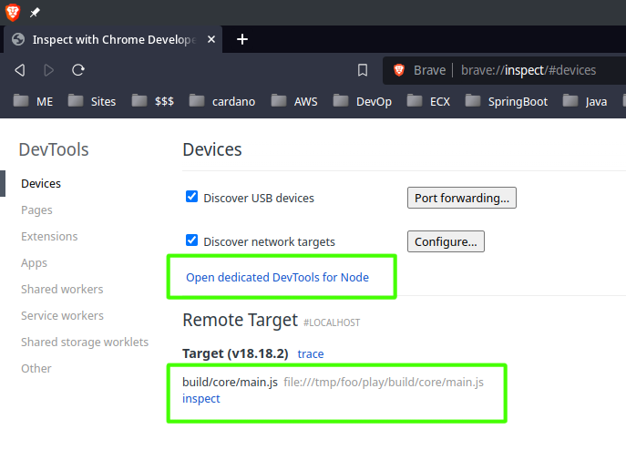
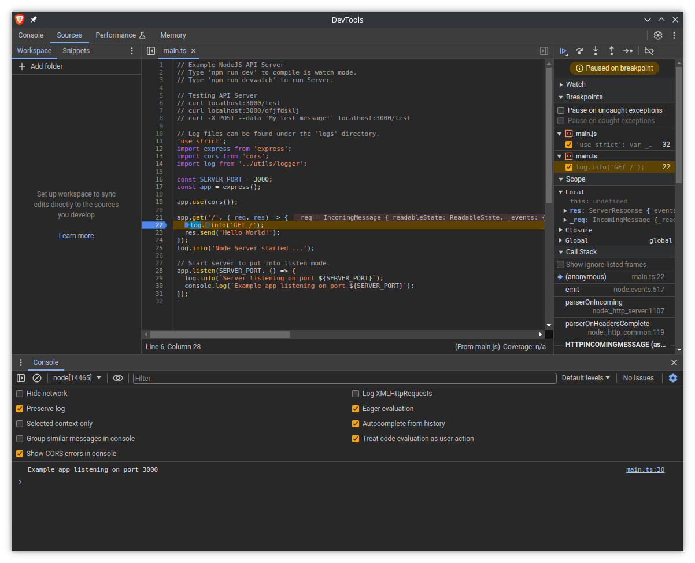

# Dev Mentor Project Creator Tool


<!-- @import "[TOC]" {cmd="toc" depthFrom=1 depthTo=6 orderedList=true} -->
<!-- code_chunk_output -->

1. [Dev Mentor Project Creator Tool](#dev-mentor-project-creator-tool)
    1. [Summary of Commands](#summary-of-commands)
    2. [Introduction](#introduction)
    3. [Debugging](#debugging)
        1. [VSCode debugging](#vscode-debugging)
        2. [No IDE: Build and Debug like a Pro](#no-ide-build-and-debug-like-a-pro)
    4. [Installing DM-Tools](#installing-dm-tools)
        1. [Setup the Editor](#setup-the-editor)
    5. [Viewing Usage info](#viewing-usage-info)
    6. [Benefits](#benefits)
    7. [Creating a Project](#creating-a-project)
    8. [Project Types](#project-types)
        1. [Commands](#commands)
    9. [Running a Node.js program](#running-a-nodejs-program)
    10. [Running Tests](#running-tests)
        1. [Developing and watching](#developing-and-watching)
            1. [Watching Tests](#watching-tests)
    11. [TypeScript development](#typescript-development)
        1. [Project structure](#project-structure)
        2. [Building](#building)
        3. [Warning](#warning)
        4. [Library code (Modules)](#library-code-modules)
        5. [Formatting the code](#formatting-the-code)
        6. [Linting](#linting)
        7. [Testing](#testing)
    12. [Static Web development](#static-web-development)
        1. [Browsersync Asset fetching](#browsersync-asset-fetching)
    13. [Test coverage](#test-coverage)
    14. [Create a Node.js JavaScript project](#create-a-nodejs-javascript-project)
        1. [TypeScript Node ES5](#typescript-node-es5)
    15. [Building C++ Testable Projects](#building-c-testable-projects)
        1. [Basic Usage](#basic-usage)
            1. [Project "hello_world" Creation](#project-hello_world-creation)
        2. [Building Project](#building-project)
        3. [Running hello_world program](#running-hello_world-program)
        4. [Running the Test Program](#running-the-test-program)
        5. [Micro Test - Testing Your Project](#micro-test---testing-your-project)
    16. [TypeScript Coding Guideline](#typescript-coding-guideline)
    17. [Debugging](#debugging-1)

<!-- /code_chunk_output -->

## Summary of Commands

Jump to [all commands](#commands) with their usage and description.

## Introduction

__DM-Tools__ is a command-line utility for generating a project for the following programming languages.

1. TypeScript
1. HTML, CSS, Sass
1. C++

Focus has been put into encouraging the use of best practices and the best tools.

Version of Node supported: Node v14.16.1+, for version earlier you will need to polyfill using "__core-js__".

## Debugging

Both No IDE browser debugger and VSCode debugger support is provided.

### VSCode debugging

Make sure project is open in VSCode. To get started open a terminal and type:

```sh
npn run debug
```

This will start a debug build for TypeScript files in development build mode then run it using Node.js and immediately break. JavaScript program will run immediately and break.

From VSCode press "F5" to run the debugger, it will attached to the started Node.js program in break mode. Step through the code or pressed "F5" to continue executing the program.

Set breakpoints 🎯 and step through code like a debugging pro. 😎

Feel free to edit make code edit, this will cause a rebuild on file save. You will need to re-start the debugger and press "F5" after a new build.

### No IDE: Build and Debug like a Pro

You can easily run and debug any TypeScript, JavaScript, Node.js program with ease. You do not need and IDE to debug! 💪🏽 All you need is a terminal and a browser and you can step through any code.

It is even possible to debug remotely, for more information, read the [Node Debugging Guide](https://nodejs.org/en/guides/debugging-getting-started).

To get started open a terminal and type:

```sh
npm run debug
```

This will start a debug build for TypeScript files in development build mode then run it using Node.js and immediately break. JavaScript program will run immediately and break.

Next open a browser.

Browser | Debug URL
-|-
Brave| `brave://inspect`
Chrome| `chrome://inspect`
Edge|`edge://inspect`

Look for an "__Open dedicated DevTools for Node__" or "__inspect__" link.



Clicking on either link will popup a browser debug window. You are good to go. ✅

Set breakpoints 🎯 and step through code like a debugging Wizard. 🧙🏽‍♂️



__NOTE__: TypeScript file(s) will appear in the debugger windows, not transpiled JavaScript files. ❤️

## Installing DM-Tools

```sh
npm install -g dm-tools
```

This will make the command "__dm__" available from the terminal.

### Setup the Editor

On Linux you can set the 'EDITOR' environment variable to point to the location of the source code editor of your choice. It will open up under the root directory of the project just created.

Determine the location of your IDE (vscode or vscode-insider).

Add something like the following to your Bash configuation file: "__~/.bashrc__".

```sh
export EDITOR="/usr/local/bin/code-insiders"
```

## Viewing Usage info

Use the "__-h__" or "__--help__" option to view help on usage.

```sh
$ dm -h
Usage: dm <command> <project> [options...]

     commands: new

Options:
  -v, --version      Show current version
  -t, --type <type>  Node.js project types: koa, node, pg, ts, web
  --e2e              end to end testing
  -w, --web          simple static Web setup
  --cpp [items]      C++ project
  -D, --debug        C++ debug build
  --release          C++ release build
  -M, --make         C++ Unix Makefile build
  --xcode            C++ XCode Makefile
  --eclipse          C++ Eclipse CDT4 Makefile
  -N, --nmake        C++ Window NMak Makefile
  -h, --help         display help for command

Dev Mentor DM-Tools
Create C++, TypeScript and JavaScript projects.

Website: https://www.npmjs.com/package/dm-tools
```

## Benefits

Here are the benefits you will enjoy right out of the gate:

- ✅ Quick start
- ✅ Best practices
- ✅ Build system
- ✅ Code in TypeScript
- ✅ Easy no IDE debugging
- ✅ HTML, CSS & Sass live edit and preview
- ✅ Error logging
- ✅ Code linting
- ✅ Code formatting
- ✅ Unit testing
- ✅ Functional testing
- ✅ Code coverage
- ✅ Document generation

## Creating a Project

Start playing with the demo starter project now, the generated source code is located in the project "__src/__" sub-folder.

```sh
dm new demo
cd demo
```

__Note__: If you are using DM-Tools generated project will use pnpm, yarn, npm in this order, if any are installed on your system.

## Project Types

To create a specific started project type, use the following syntax:

```sh
dm new <project-name> -t <type>
```

The following basic project types that can be created using DM-Tools are:

__NOTE__: Default project type is "__ts__" if not type passed.

Type|Language|Description
-|-|-
ts|TS|TypeScript Express.js Server (Zero compile with static Website)
pg|TS|TypeScript PostgreSQL Express.js Server.
web|HTML Sass |Static Website.
node|TS|TypeScript Node.js Server.
koa|TS|Koa Node.js API Server in TypeScript.
cpp|CPP |C++ with Micro Test using CMake.

### Commands

The following NPM commands you will be using with your project are:

NPM Scripts|Description
-|-
dev|Development build and watch mode.
debug|Start a debug session, attach to process (usually press F5).
test|Run Unit test.
test:coverage|Run Unit test with coverage.
test:watch|Run Unit test in watch mode.
test:e2e|End to end test with Playright.
web|Start static web server. Play with HTML, CSS.
build|Build the project for production.
release|Build the project for production.
start|Run built Node.js program.
check|Perfrom TypeScript typechecking.
lint|Lint the source code.
format|Format the source code.
doc|Generate doc files (jsdocs).

__IMPORTANT__: Since [gazeall](https://www.npmjs.com/package/gazeall) is being used to watch and rebuild file, do not call other NPM script from it with watch-mode enabled. This can result in execution problems and the build entering a cycle of repeated rebuilds.

## Running a Node.js program

To simply run a production build of the Node.js program, type:

```sh
npm start
```

This will perform a clean build and run the demo program from the "__build/__" folder. The demo application log will be produced in the "__logs/__" sub-folder under the project root.

## Running Tests

To run tests with coverage for the TypeScript / Node.js based programs, type:

```sh
npm test
```

It might be a good idea to run all the tests with coverage before a production build.

### Developing and watching

You can run and watch a Node.js based program during development. To do this, open a terminal and type the following.

```sh
npm run dev
```

This will kickoff the "dev build" and "dev watch" NPM scripts.

#### Watching Tests

To watch the unit tests while developing, type the following command in a new terminal.

```sh
npm run testwatch
```

## TypeScript development

### Project structure

Place all TypeScript source code under the folder, "__src/__", they will be picked up from here and compiled to the, "__build/__" folder under the project root.

You are free to create addition folders and sub-folders under, "__src/__", the compiler will recursively find and compile all TypeScript code.

All TypeScript code is compiled to __ES2020__ JavaScript. The target JavaScript code can be changed from the [TypeScript configuration](https://www.typescriptlang.org/docs/handbook/tsconfig-json.html) file, "__tsconfig.json__".

Some of the things you may want to configure:

- Files to compile
- Folders to include
- Folders to exclude
- Target compiled output
- Source map (Needed for debugging)
- Module system (Use commonjs for Node)
- Output file

Some of the supported compiled targets include:

```pre
ES2016, ES2017, ES2018, ES2019, ES2020, ES2021, ES2022, ESNext
```

See [compiler options](https://www.typescriptlang.org/docs/handbook/compiler-options.html) for more details.

### Building

To compile the TypeScript code, use the following command to start the build process:

```sh
npm run release
```

### Warning

The "__build/__" folder and all sub-folders within it will be deleted to insure a clean build is performed each time. Do not place any files you will need later in the "__build/__" folder.

### Library code (Modules)

Place any module or library source code that you write under the, "__src/lib/__", sub-folder. The compiled source code will be output to the, "__build/lib/__", sub-folder.

### Formatting the code

The source code will be automatically formatted during development and production build. This will also happen before source code is committed to __Git__.

It is good practice to format the source code, so it conforms to a uniform structure. Avoid squabbles about style. Formatting in run by the NPM script, "__format__".

### Linting

To validate the project TypeScript source code, use the following command:

```sh
npm run lint
```

__Note__: The TypeScript source code is run through a linter (__ESLint__) before a build and before it is committed to the Git repository. Any errors encountered must be fixed before the Git commit is allowed to proceed.

**Important!**: I have noticed, once in a while the git hooks will continue to fail when there is nothing really wrong. If you suspect this is the case, the easy fix is to delete the "__node_modules__" folder. Follow this with a "__npm install__" or simply type "__yarn__" and then try to commit or push the code again.

### Testing

[Testing is done using Jest](https://jestjs.io/), the test methods are simple and easy to learn.

The test code should be __co-located__ with the production source code. As a best practice, place tests under a sub-folder called "__test/__".

Pay attention to how the test source file is named: "__test.\<file\>.ts__". So if you have a file called, "__filter.ts__", the test file should be named, "__test.filter.ts__".

To run the test, type:

```sh
npm test
```

__Note__: Running the test will cause a fresh build to be kicked-off. Once the build finishes, all the unit tests will be run.

## Static Web development

If you want to hack around with HTML, Sass and try things out quick. Start the project in __web__ mode using the following command:

```sh
npm run web
```

This will run the build first and then open a web browser on port 3000, and load the HTML page, "__index.html__" located in the "__src/__" sub-folder.

Any changes made to "__index.html__" will automatically update and browser on save. You do not need to keep hitting __refresh__ on the browser.

The website uses lite-server, which is based on Browsersync to run a local development web-server and keeps all browsers listening to it in sync. This means it is possible to have multiple browsers listening to the server.

On how to configure the setup, read the [Browsersync options](https://browsersync.io/docs/options).

Basic configurations setting you may be interested in are:

- files
- server
- proxy
- logLevel
- port

The default Browsersync UI web address is: `http://localhost:3001/`.

### Browsersync Asset fetching

With Browsersync, having to serve addition CSS and JavaScript files, make sure to add their path in routes. Something similar to like this:

```js
  "server": {
    baseDir: "src",
    routes: {
      "/node_modules/tachyons/css":"node_modules/tachyons/css"
    }
  },
```

This will allow including "__\<script\>__" assets from the index.html file like this:

```html
<head>
  <link rel="stylesheet" href="./node_modules/tachyons/css/tachyons.min.css">
</head>
```

## Test coverage

Test coverage is done when test is run using "__nyc__". The test coverage result is displayed to the console after the results of the unit tests. A folder called "__coverage/__" will be created under the project root. It will hold the results of the code coverage from the test run. Of interest to you will be the HTML report. It is a nice way to see what code was covered and what code was not by the unit tests.

To configure the test coverage, make changes to the "__nyc__" settings found in the file "__package.json__".

## Create a Node.js JavaScript project

If you want to develop in plain JavaScript, or develop a ES6 Node.js based project, this is now supported. It is also good for quickly testing out code and not getting slowed down by the compile step.

You will need the latest version of Node.js for ES6 and beyond support, otherwise plain JavaScript will continue to work.

```sh
dm new demo --type js
npm install
```

__Note__: You may also use "__-t__" which is the short-form for "__--type__".

The plain JavaScript generated file has a development mode. It will run the __Entry__ file ("__main.js__") using Node.js each time the source code is updated. You can develop and see the output from the __terminal__ to test out code quickly.

```sh
npm run dev
```

### TypeScript Node ES5

If you need to use ES5 Node.js support with TypeScript here are the following change you need to make.

Make sure you're using Node v14.16.1 or higher.

Add the following two lines under compilerOptions to "__tsconfig.json__" and "__tsconfig.test.json__".

```js
"compilerOptions": {
  "target": "es2020",
  "lib": [
    "es2020",
    "es2019",
    "es2018",
    "es2017",
    "dom"
    ]
}
```

## Building C++ Testable Projects

DM-Tools can be used to create a C++ project with Unit Testing setup using [Micro Test](https://github.com/rajinder-yadav/micro_test).

The C++ project uses [CMake](https://cmake.org/) to generate cross-platform Makefiles for:

1. Linux
1. MacOS
1. Windows

### Basic Usage

Let us go through the steps of creating a simple "hello_world" project.

#### Project "hello_world" Creation

The created project will be found under the __hello_world__ folder.

```sh
cd /tmp
dm new hello_world --cpp
```

### Building Project

The Makefile is located under sub-folder build.

```sh
cd hello_world/build
make
```

### Running hello_world program

The executable hello_world will be found in the build folder.

```sh
./hello_world
```

### Running the Test Program

The test program is located under build/test/ sub-folder. Initially one failing test is created for you to follow.

```sh
./test/test.hello_world
```

### Micro Test - Testing Your Project

DM-Tools creates a test sub-folder under src/ and uses the latest Micro Test header file, it basically pulls it from the Micro Test Git repository.

To learn more about how to write tests using [Micro Test](https://bitbucket.org/rajinder_yadav/micro_test) check out the project site. You will be amazed how simple and fast it is to write test code.

## TypeScript Coding Guideline

Read the [coding guideline](https://github.com/devmentor416/devmentor/wiki/Coding-guideline) found in the wiki.

## Debugging

If you get a post or address is use, you might have a background process that didn't shutdown correctly. To shut it down, use the following command to find its process ID and then kill it.

```sh
lsof -i :PORT
lsof -i :3000

kill <PIDP>
kill -9 <PIDP>
```

__Happy Hacking =)__
